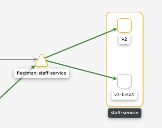
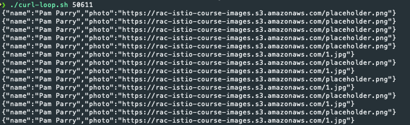
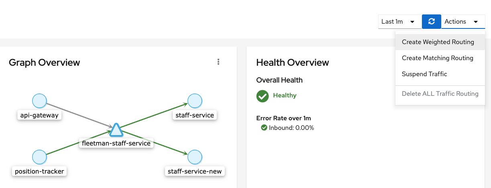
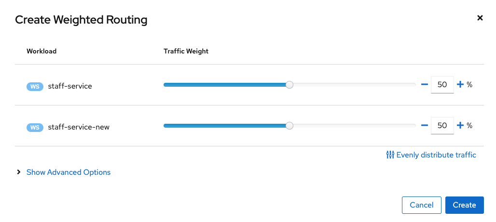

# Traffic Labs

## Objectives

* Service LB of multi-pods
* Kiali and Declarative configuration of Weighted Routing
* Debugging with Kiali
* VirtualServices and DestinationRules

## Getting Started

Either destroy cluster or remove apps from last lab

## staff-service Deployment

The application was built as a micro-services.  The staff-service was stubbed out with a placeholder that will are about to test the new service to replace the placeholder.
Examine the 3-app.yaml file, look for the staff-service Deploy service and notice the image.

Step 1:  Deploy as is and explore the app.  Notice the placeholder.

Step 2:  Add the label of `version: v1` to the Deployment pod.

```yaml
spec:
  selector:
    matchLabels:
      app: staff-service
      version: v1
  replicas: 1
  template: 
    metadata:
      labels:
        app: staff-service
        version: v1
```

Step 3: Copy the Deployment, Duplicate it with a new name and a new version. New version `version: v2-beta1` and remove the `placeholder` tag from the docker image to be `kensipe/fleetman-staff-service:1`

Deploy changes (watching kaili will show traffic changes)

Step 4:  Review Kiali with services



Step 5: Test it with browser or curl

`minikube service fleetman-webapp --url`
`./curl-loop.sh 50611`
**note:** you need to change the port number to your specific port provided by minikube



Step 6: Lets change the weighted values in kiali



* reexamine with curl
* reexample kiali graph

Step 7: Example Virtual Services and Destination Rules

* From Kiali
* From kubectl `k get vs` and `k get dr`

The `ref-vs-dr.yaml` file contains the details.. try using it to change the weighted values and test again.
